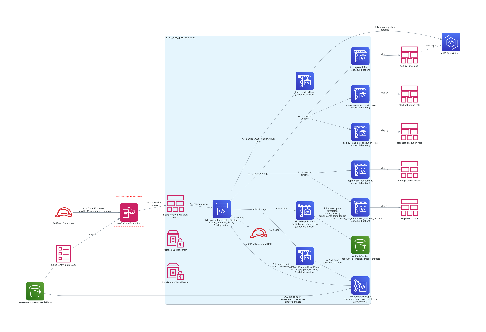

======================
Component Reference
======================

This section serves as a detailed reference of the platform components. The components are divided up into multiple use cases listed below. The :ref:`reference:high level architecture diagram` is shown below and each of the marked use cases can be explored in detail in the corresponding sub-sections. Please note that the images are large. We recommend clicking on each diagram and use zoom to make the text legible and explore the architecture in detail. 

* :ref:`reference:high level architecture diagram`
* :ref:`reference:a - deploy infrastructure`
* :ref:`reference:b - create project`
* :ref:`reference:c - create user`
* :ref:`reference:d - launch amazon sagemaker studio`
* :ref:`reference:e - trigger cicd`
* :ref:`reference:f - approve deployment`
* :ref:`reference:g - monitor performance`

High level architecture diagram
================================

A - Deploy Infrastructure 
===========================

As a Full-Stack Developer, deploy the initial infrastructure using one-click deployment.

**Description**

This use-case is initiated by the FullStackDeveloper role to deploy the initial infrastructure. This is accomplished once to enable all other use cases for a particular AWS account or set of accounts. 

The following resources are deployed:

* VPC, subnets, security groups, VPC endpoints
* SageMaker Studio Domain
* Artifact S3 bucket, which is used by the Code Build projects and Code Commit repositories to store and load artifacts
* Code Pipeline `ModelRepoPipeline` is deployed. `ModelRepoPipeline` depends on the `aws-enterprise-mlops-platform` Code Commit repository. The repository has to be created to enable all other use cases. 
* `MLOPSProduct` Service Catalog product to create SageMaker projects

B - Create Project
===================

As a Data Science Admin (DataScienceAdmin role), create a SageMaker Project.

**Description**

This use-case is initiated by the DataScienceAdmin role after logging in SageMaker Studio. This step is accomplished every time when a new data science project is started within the organization. 

The following resources are deployed:

* SageMaker project is created in SageMaker Studio after the template was generated during the initial deployment by the FullStackDeveloper role as outlined template in the section :ref:`reference:a - deploy infrastructure`. Data Science Admin provides project description, value for the CostCenter tag, and DataScientistRole ARN as parameters to the underlying SageMaker project cloudformation template (2-smproject.yaml) associated with the SageMaker Project Service Catalog product.
* Project creation initiates deployment of a CloudFormation stack with resources needed for the project

C - Create User
===================

As a Data Science Admin, associate a user with a project. This step is performed in AWS Service Catalog console and performed for every data scientists who will work on a newly created project.

**Description**

The following resources are deployed:

* The new user is created by launching a CloudFormation stack with resources such as CodePipeline and CodeBuild
* The CodeBuild project will run a python script to associate the new SageMaker Studio user with the existing project

D - Launch Amazon SageMaker Studio
==================================

As a Data Scientist start model development in SageMaker Studio. This use case will be run for every project and data scientist.

**Description**

The data scientist logs into SageMaker Studio and begins experimentation with the data and model. Data Scientist starts SageMaker Processing, Training, Batch Transform, and Hyperparameter Tuning jobs. These jobs will depend on the type of the project and the type of inference (as defined during the project creation). These choice of algorithms and the associated parameters might be different for every data scientist on a project. 

E - Trigger CICD
==================================

As a Data Scientist begin the process of promoting the model to production.

**Description**

When a data scientist is finished with experimentation with the data and the model, they will be ready to push the model to production. It is triggered by pushing code changes to a development branch of the project repository and merging the development branch with the main branch. 

The following resources are deployed upon the branch merge:

* `ModelBuildPipeline` Code Pipeline runs to build and push the new container images to the ECR repositories
* SageMaker Pipeline is run with the ECR images to retrain the model
* Model is added/updated in the SageMaker Model registry

F - Approve Deployment
==================================

As a Data Scientist approve the model.

**Description**

This use case happen occur multiple times per project. After pushing the code to production (see :ref:`reference:e - trigger cicd`) the data scientist will approve the latest model version in SageMaker Studio.

The following resources are deployed:

* The model is deployed to a staging stack (`deploy` Code Pipeline execution is triggered) and the deployment to production is paused until manually approved by a data scientist.
* Upon approval, the model will be deployed to a production stack.
* Model monitoring schedule is created and attached to the production endpoint.

G - Monitor Performance
==================================

As a Data Scientist monitor model performance using Model Monitoring feature of SageMaker. 

**Description**

This use-case is used on an ongoing basis for all models in production. It allows the data scientist to manually inspect the results of the SageMaker Model Monitor executions.

There are four ways model performance is to be monitored: data quality, model quality, bias drift, and feature attribution drift. For details please see: `Amazon SageMaker Model Monitor <https://docs.aws.amazon.com/sagemaker/latest/dg/model-monitor.html>`_.

The SageMaker Model Monitor jobs generate data and model quality statistics based on the requests sent to the endpoint and responses provided by the endpoint.  These jobs are scheduled as SageMaker processing jobs using a prebuilt SageMaker container. The monitoring results are saved to the project S3 bucket at the end of each job execution. These results can be read and inspected by the data scientist in SageMaker Studio Jupyter Notebook (G.2 on the diagram below). 

The simulated requests (G.4 on the diagram below) and responses (G.6 on the diagram below) are only performed if there is no traffic to the deployed endpoint, however the data scientist wishes to process a sample dataset against the model monitor.

The hourly SageMaker processing job checks the requests and responses captured by the endpoint and compares the results against the baseline from use case E. The processing job will generate a violation report if there are requests to the endpoint with feature values outside the constraints or expected bounds. These violations might indicate a drift in data quality. 

