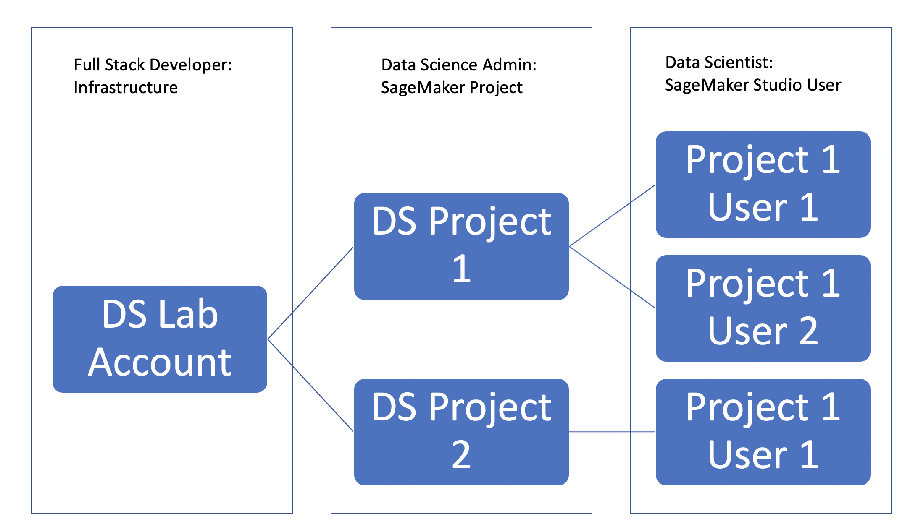

Overview
=========

Platform summary
-------------------

The AWS Enterprise MLOps Platform (the platform) sets up a complete Enterprise-ready MLOps infrastructure for your organisation. This consists of:

* An **isolated VPC environment** (no external internet access) with security controls such as customer-managed KMS key encryption, to operate ML operations securely.
* Separate **roles** to govern access to resources on a need-to-know basis (Admin, DataScienceAdmin, and DataScientist).
* Governed ML **projects** with: managed access, source code repository, experiment tracking, and CI/CD. These projects use SageMaker Studio Projects and are managed by a DataScienceAdmin.
* Separate SageMaker Studio **users** isolated to a project (corresponding to the DataScientist role), managed by a DataScienceAdmin. Corresponding SageMaker Studio environments as a workspace for each user to securely develop ML models and collaborate with other project members. These users are created by
* Complete **CI/CD** setup for each ML project that automatically trains and deploys models into production out of the box using SageMaker Pipelines. DataScientists mange this themselves, using an organisation-approved template, with a human-in-the-loop approval step for production deployment. This is automated behind-the-scenes so DataScientists do not need to understand the details.
* Pre-developed **project templates** for popular ML project tasks such as supervised learning with sklearn, tensorflow, and huggingface.
* Pre-configured templates for **model monitoring**.
* **Batch and real-time inference** deployment into production.
* The ability to deploy models into a **separate AWS account**.
* A private **PyPi server** using AWS CodeArtifact to enable the installation of Python libraries not included with base SageMaker Studio kernels as there is no external internet access.
* Out-of-the-box access to tools in the **Amazon SageMaker** suite of products.

The platform provides a series of CloudFormation templates which are used to deploy these facilities in 1-click into AWS account(s). Customisations are commonly required to adapt some of the components to an organisation's AWS infrastructure, please contact your AWS account manager for assistance.

ML operations
-------------------

There are several steps required for the development and deployment of machine learning models. Due to this complexity, many organizations choose to partition these components into different teams with specialized skillsets.

   A siloed approach to model development and deployment.

The result is a process that can be time consuming, decentralized, and one directional.  AWS Enterprise MLOps Platform seamlessly integrates these components to create a central, bi-directional workflow that can be managed end-to-end by the Data Science team.

   Model development and deployment with AWS Enterprise Platform

To accomplish this two key pillars are established:

1.  A Data Science Lab to be used for data exploration and model development.
2.  An MLOps process responsible for building and deploying models trained in the data Science Lab.

   The two pillars of the AWS Enterprise MLOps Platform.

Crucially, the platform creates a shared configurations file to be updated by the development team and then read and executed by the CI/CD process responsible for building and deploying models.  As a result, **there is no need for intervention from any teams outside of Data Science in order to initiate the model deployment process**.

   A shared configuration file enables seamless trasition from development to deployment

Roles
---------------

The Enterprise MLOps Platform creates and assumes the following roles:

.. list-table:: Enterprise MLOps Roles
   :widths: 25 25 50
   :header-rows: 1

   * - Role
     - Responsibilities
     - Entry Point
   * - Full Stack Developer
     - | Network Infrastructure
       | SageMaker Studio Domain
       | Source Code Repositories
       | Service Catalog Product
     - CloudFormation
   * - Data Science Admin
     - Project and User Creation
     - Sagemaker Studio
   * - Data Scientist
     - Model Development
     - Sagemaker Studio
   * - ML Engineer
     - Pipeline Development
     - NA

The `Full Stack Developer` role is responsible for a one time deployment of the initial infrastructure required for the platform.  A `Data Science Admin` role is responsible for creating new SageMaker Projects and SageMaker Studio Users assigned to the projects.  A `Data Scientist` role only has access to SageMaker Studio Users that have been created for their projects. Finally, an `ML Engineer` role has no direct involvement in the initial deployment but is required for maintaining and updating the CI/CD workflows.

Workflow and infrastructure
----------------------------

The diagram below shows how different teams work together to set up the MLOps platform and deliver the ML/AI model from development to production efficiently.

Base infrastructure
^^^^^^^^^^^^^^^^^^^^^

1.  The Full Stack Developer manages the cloud/infrastructure needed for the development environment.

The following architecture is deployed by the Full Stack Developer persona using the CFN template `1-infra.yaml`:

   Infrastructure deployed by the Full Stack Developer persona

`VPC` - A VPC where compute will occur

`Subnets` - Two private subnets

`SageMaker Studio Domain` - a SageMaker Studio Domain in VPCOnly mode

`SageMaker Studio User` - a SageMaker Studio User for the DataScience Admin persona

`Security Group - Compute` - a Security group for all of the compute (e.g. SageMaker Training, SageMaker Processing) jobs

`Security Group - VPCE` - a Security group for all of the VPC Endpoints

`CodeArtifact - Private PyPi` - Because we are deploying SageMaker Studio Domain into private subnets in VPCOnly mode, we do not have access to the outside internet.  In order to enable the installation of Python libraries not included with base SageMaker Studio kernels, we create a private PyPi server using CodeArtifact that is deployed as part of the infrastructure build.

`S3 - CICD Artifacts` - S3 bucket to store project agnostic artifacts created by CICD processes

`Service Catalog - SageMaker Project Product` - A ServiceCatalog Product used for creating SageMaker Projects

`Lambda - Experiment Tagging` - A Lambda function responsible for tagging SageMaker Training jobs

`CodeCommit - Source Repositories` - Three CodeCommit repositories holding the source code

`VPC Endpoints` - VPC Endpoints to allow communication to the services listed above from the private subnets

Source CodeCommit resources
~~~~~~~~~~~~~~~~~~~~~~~~~~~~~~~

Three folders in the 'aws-enterprise-mlops-platform' CodeCommit repositories in the 'src/project-templates/<project-name>' path are created within the development account to enable MLOPs Platform within the target account.  The `mlops-cfn` folder contains all of the infrastructure as code in the form of `CloudFormation <https://aws.amazon.com/cloudformation/>`_ templates.  The `mlops-cicd` folder contains all of the code executed by CICD processes using `CodePipeline <https://aws.amazon.com/codepipeline/>`_ / `CodeBuild <https://aws.amazon.com/codebuild/>`_ or `SageMaker Pipelines <https://aws.amazon.com/sagemaker/pipelines/>`_.  Finally, the `seedcode-repo` folder contains template code that is cloned into development environments as start-up time.

By maintaining three repositories organized by function, we enable each Persona to maintain and update functionality independent of other teams.

.. list-table::
   :widths: 25 25 50
   :header-rows: 1

   * - Folder
     - Contains
     - Managed By Persona
   * - mlops-cfn
     - CFN templates representing all infrastructure deployed
     - Full Stack Developer
   * - mlops-cicd
     - Scripts and jobs for CICD builds
     - ML Engineer
   * - seedcode-repo
     - SageMaker Notebooks and model training seedcode
     - Data Scientist

Project infrastructure
^^^^^^^^^^^^^^^^^^^^^^^^

2. Next, The Data Science Admin creates a new Data Science use case with a custom `Sagemaker Projects <https://docs.aws.amazon.com/sagemaker/latest/dg/sagemaker-projects-whatis.html>`_ template.

The following architecture is deployed by the Data Science Admin persona when creating a new project:

`Project IAM Role` - An IAM Role created specific for the use case, to be assigned to SageMaker Studio Users for the project

`SSM Parameters` - Recording of project specific parameters in SSM Parameter Store (e.g. project role, project bucket, project KMS key)

`ECR Repository - Preprocessing` - An ECR Repository to hold images built for the project Preprocessing job

`ECR Repository - Training` - An ECR Repository to hold images built for the project Training job

`ECR Repository - Inference` - An ECR Repository to hold images built for the project Model object

`Project KMS key` - A KMS key to be used specifically to encrypt data for this use case

`Service Catalog Product - SM Studio User` - A Service Catalog Product that can be used to launch a SageMaker Studio User for this project

`Project CodeCommit Repository` - A CodeCommit Repository to hold project code for model training

`SageMaker Studio Lifecycle Configuration` - A project specific LifeCycle Configuration script to be assigned to SM Studio Users created for the project

`CodePipeline - Build Pipeline` - A CodePipeline used to build models for the project and register them to Model Registry

`CodePipeline - Deploy Pipeline` - A CodePipeline used to deploy registered models for the project and activate SageMaker Model Monitor

`CloudWatch Events` - Project specific events to automate workflows

3.  And third, the Data Science Admin uses Service Catalog to create a SageMaker Studio User assinged to a specific Data Scientist for a specific project.

.. figure:: images/studio_user.png
   :scale: 100 %
   :alt: studio user

