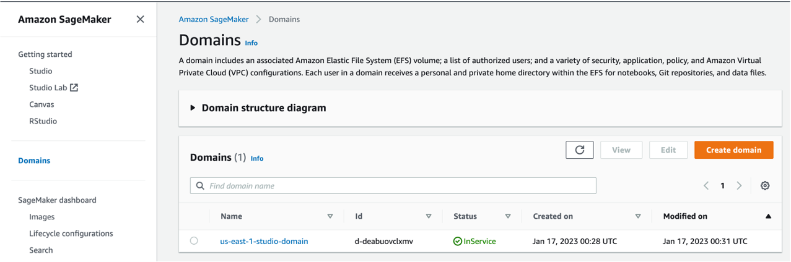
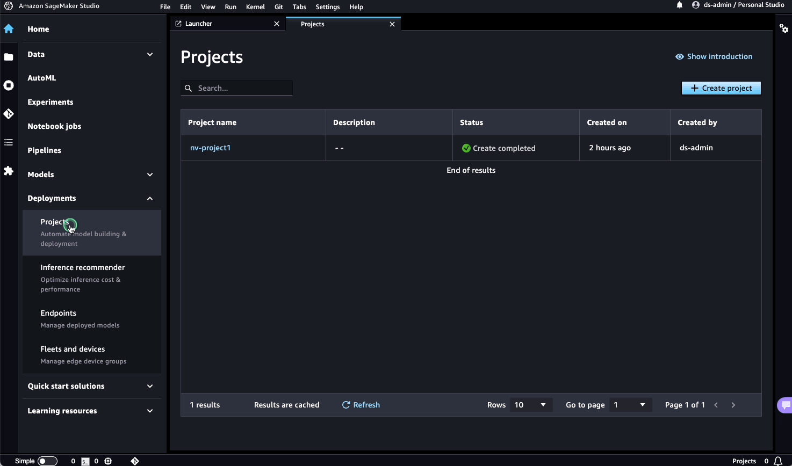
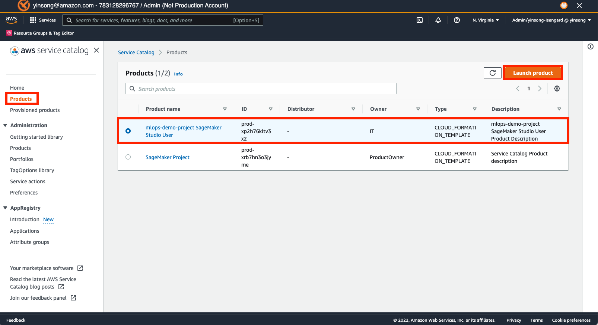
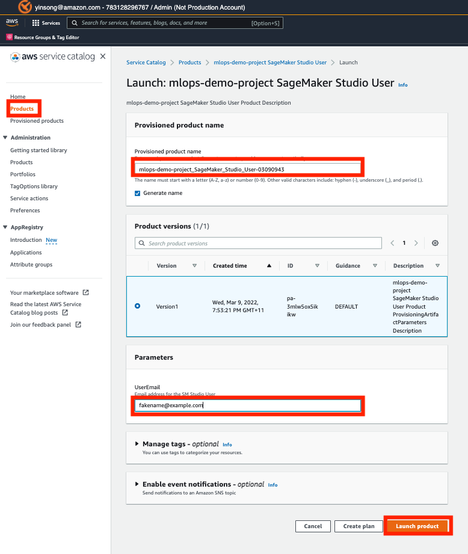
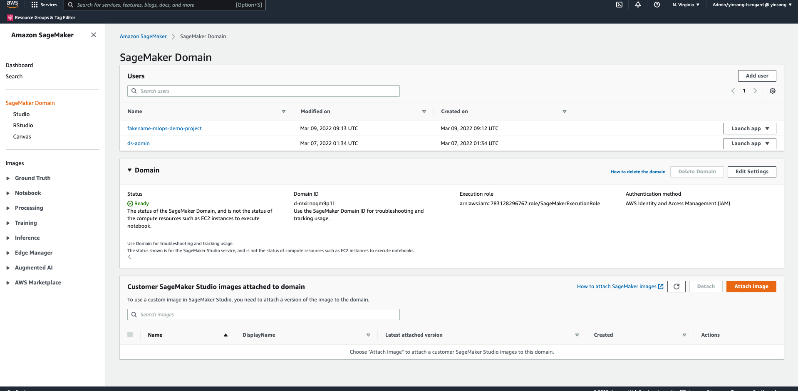

Platform setup
=========================================================

To get started you will need an AWS account where this platform hasn't been installed previously. Here are main steps :

* :ref:`started:Deploy the Infrastructure`: you will need Admin privileges in your AWS account to deploy the infrastructure using CDK. The process takes approximately 1 hour and involves deployment of the necessary infrastructure. It is important to **configure SSO** as the roles during the infrastructure deployment need to be linked to users in your environment. This will depend on how SSO is set up in your organisation.
* :ref:`started:Create a SageMaker Project`: The Data Science Admin logs to SageMaker Studio through AWS console and creates an isolated SageMaker Project for data science work.
* :ref:`started:Create a SageMaker Studio User`: Data Science Admin logs into the AWS console to create a new SageMaker Studio user using `AWS Service Catalog <https://aws.amazon.com/servicecatalog/>`_ and links the new user to the project created in the previous step. 
* :ref:`started:Launch SageMaker Studio as Data Science User`: A Data Scientist logs into the AWS console, accesses SageMaker user to which they have access, launches a SageMaker Studio session and begins working on a data science project that was defined for them by the Data Science Admin in the previous step.

Deploy The Infrastructure
-------------------------

TASK: Deploy the initial infrastructure using CDK. 

Prerequisites
^^^^^^^^^^^^^

1. 4 AWS Accounts: Each account has a user with aws_access_key_id and aws_secret_access_key
2. You can use this template `credentials <https://quip-amazon.com/-/blob/dMe9AAWl58S/nbYEYfqGzPZkj0aC36zhkA?name=credentials>`_ for your credential and saved at your aws configure location, the location for macOS is your root user name ./aws/credential
    Note: Keep your access key and secret access key safe and secure locally, never share them with anyone or save them in the same location as your code that will be pushed to GitHub or Cloud.
    Note: Running the bash script uses brew to install all dependencies, make sure you have brew installed (see brew.sh)
3. Keep account ID handy for all four accounts
    *	Gov
    *	Dev
    *	PreProd
    *	Prod
4. Node.js 
5. Python3.8+ or Miniconda
6. AWS CDK v2 (brew install aws-cdk)
7. AWS CLI
8. GIT
9. Docker (Running Docker is a must on your Desktop)

Install Prerequisites (Skip if installed manually on previous step)
^^^^^^^^^^^^^^^^^^^^^^^^^^^^^^^^^^^^^^^^^^^^^^^^^^^^^^^^^^^^^^^^^^^
Install requirements by running the entire script or installing commands one at a time, as directed in the cloned repository. The bash file is located at mlops-multi-account-cdk/mlops-infra/scripts/install-prerequisites-brew.sh
  #. Run mwinit to authenticate
      mwinit —aea
  #. Install brew per brew-sh website
      /bin/bash -c "$(curl -fsSL https://raw.githubusercontent.com/Homebrew/install/HEAD/install.sh)"
    * Note: You may get this error
      ssh: Could not resolve hostname git.amazon.com: nodename nor servname provided, or not known
      fatal: Could not read from remote repository.

    * To resolve run you can either do one of these:
      * Uninstall currently existing Homebrew
        /bin/bash -c "$(curl -fsSL https://raw.githubusercontent.com/Homebrew/install/HEAD/uninstall.sh)“

      * Error in installing brew, use this to set up cetificates on work mac
          ssh-keyscan git.amazon.com >> ~/.ssh/known_hosts
          or
          kinit -f && mwinit -o && ssh-add

Step by Step Guide
------------------

Step 1: Getting the assets
^^^^^^^^^^^^^^^^^^^^^^^^^^
Create a folder named “mlops-cdk” or a name you prefer and navigate to the folder in your Terminal or CMD. Clone SageMaker Customer Project Templates repository from AWS Samples, copy the mlops-multi-account-cdk 

    # Create a new directory
    mkdir mlops-cdk
    # Navigate to your new directory
    cd mlops-cdk
    # Clone public repo with the CDK solution
    git clone https://github.com/aws-samples/sagemaker-custom-project-templates
    # Create a copy of MLOps Multi-Account CDK 
    cp -a sagemaker-custom-project-templates/mlops-multi-account-cdk ./

Step 2: Set up Python
^^^^^^^^^^^^^^^^^^^^^
    You need to create a Python virtual environment
    conda create -n cdk python=3.8 # I tested on 3.8 but you can try latest).
    conda init zsh
    conda activate cdk

    ## Install python packages
    pip install awscli

Step 3: Update the assets with Account ID and Deployment Region
^^^^^^^^^^^^^^^^^^^^^^^^^^^^^^^^^^^^^^^^^^^^^^^^^^^^^^^^^^^^^^^
    * Navigate to mlops_infra/mlops_infra/config folder and update these two files:
      	* accounts.json: 
          #. Add Account ID for Dev, Preprod and Prod. It should look like this.
                ``{
                    "SET_NAME": "first-example",
                    "DEV_ACCOUNT": "123456789012",
                    "PREPROD_ACCOUNT": "123456789012",
                    "PROD_ACCOUNT": "123456789012"
                }``
 
                
        * constants.py:
          #. Add Gov AWS Account ID and Region of Deployment. It should like this:

                CODE_COMMIT_REPO_NAME = "mlops-infra"
                PIPELINE_BRANCH = "main"
                PIPELINE_ACCOUNT = "123456789012"  # account to host the pipeline handling updates of this repository
                DEFAULT_DEPLOYMENT_REGION = "us-west-2"
                APP_PREFIX = "mlops"

    #. Navigate to mlops-sm-project-template/mlops_sm_project_template/config folder and update these two files:
      	* accounts.json: 
          * Add Account ID for Dev, Preprod and Prod. It should look like this.
          .. code-block:: JSON
              [
                  {
                      "SET_NAME": "first-example",
                      "DEV_ACCOUNT": "123456789012",
                      "PREPROD_ACCOUNT": "123456789012",
                      "PROD_ACCOUNT": "123456789012",
                      "DEPLOYMENT_REGION":"us-west-2"
                  }
              ]
        *	constants.py:
          * Add Gov AWS Account ID and Region of Deployment. It should like this:
          .. code-block:: python
              CODE_COMMIT_REPO_NAME = "mlops-sm-project-template"
              PIPELINE_BRANCH = "main"
              PIPELINE_ACCOUNT = "123456789012"  # account used to host the pipeline handling updates of this repository
              DEFAULT_DEPLOYMENT_REGION = "us-west-2"
              APP_PREFIX = "mlops-cdk"

    This deploys a cloudformation stack named 'aws-mlops-accelerator-stack' which in turn deploys the following stacks to deploy the project's initial infrastructure:
    stackset-execution-role,
    stackset-admin-role,
    deploy-infra-stack,
    sm-tag-lambda-stack,
    sc-project-stack,
    AWS Enterprise MLOps Platform uses `AWS CodeArtifact <https://aws.amazon.com/codeartifact/>`_ to serve as a prive PyPi server.  With this in mind, please ensure you are deploying into a `region that includes a CodeArtifact endpoint. <https://docs.aws.amazon.com/general/latest/gr/codeartifact.html>`_

Create a SageMaker Project
--------------------------

TASK: as a Data Science Admin create a new data science  project and the associated resources.

This step should be performed by a data science admin in your organisation at the beginning of each new project. Notice, that the SageMaker-provided project templates have been disabled by this deployment.

After the project's initial infrastructure has been deployed, you will create a custom project in SageMaker Studio upon assuming Data Science Role. You will choose the type of the data science problem (supervised or unspervised), type of inference (batch or real time) and you will associate mandatory (CostCenter) and custom tags with the project. The CostCenter tag is used for tracking the spending associated with the project. 

The steps are outlined below:

1. Log into AWS Console with the Data Science Admin role. Follow the link `AWS console <https://signin.aws.amazon.com/switchrole>`_ to assume the Data Science Admin role. The role has been created for you during the deployment. The role name has the following pattern:  *<region>-datascience-admin-<account_id>*). You might find it helpful to first navigate to IAM in AWS Console in order to retrieve the role name and assume it using `AWS console <https://signin.aws.amazon.com/switchrole>`_ link. 

2. Once you assume the role, navigate to Amazon SageMaker in AWS Console. On the left side panel select Domains. Click on the created domain (domain name will have the following pattern *<region>-studio-domain*). This will open **User profiles** tab for the domain information page. In the **User profiles** tab click on the Launch button next to *ds-admin* user to launch Studio.

1. Once SageMaker Studio UI is loaded click on the  Deployments->Projects menu and then the `Create project`  button. Next select the `Organization templates` tab and then the custom resource named SageMaker Project. In the lower-right hand corner, Select project template to initiate project creation.

2.  In this step we will provide parameters to our custom SageMaker project. You can optionally add other tags to the project. When ready, click `Create project` to complete the project creation. The animation below demonstrates the steps that need to be taken the by Data Science Admin in SageMaker Studio. 

|

    Important: Creation in SageMaker Studio will initiate execution of `<sagemaker_project_name>_project_pipeline` CodePipeline. The project will become available once the pipeline execution is completed. 

|

Create a SageMaker Studio User
-------------------------------

TASK: As a Data Science Admin, create a SageMaker Studio user for your project. 

After the `<sagemaker_project_name>_project_pipeline` executes, this step is performed by a data science administrator in your organization for each user who will work on a project created in the previous section. There could be 1 or many users working on a particular project and having access to its resources. 

Unlike creation of the SageMaker Studio Project, which is accomplished by the Data Science Admin in SageMaker Studio, association of the users with the newly created project is accomplished in AWS Service Catalog. In the Service Catalog the Data Science Admin will link the project created in the previous section with a specific user.

The steps are outlined below:

1. If not logged in as a Data Science admin log into AWS Console as the Data Science Admin role. Follow the link `AWS console <https://signin.aws.amazon.com/switchrole>`_ to assume the Data Science Admin role. Navigate to AWS Service Catalog in the console.
2. Select `Products` from the left-hand pane. You will see a product representing a SageMaker Studio User for the project you just created.  In this example, the project name is "mlops-demo-project" and so the Product name is "mlops-demo-project SageMaker Studio User".
3.  Select the product representing the SM Studio User for your project and click `Launch product`.

4.  In this step the Data Science Admin will customize the newly created project with Parameters. The most important customization is the `UserEmail` parameter. Enter the email of the Data Science User that will be associated with this project and will have access to its resources.

For our SageMaker Studio user, be sure to update the `UserEmail` field with the email address of the Data Scientist that will be using the SM Studio User.
|

    Note: Add note here about `attribute-based access control <https://docs.aws.amazon.com/IAM/latest/UserGuide/introduction_attribute-based-access-control.html>`_

|
    Important: Once the product is launched, it will initiate `<sagemaker_project_name>_<username>_user_pipeline` Code Pipeline execution. Wait for the CodePipeline execution to complete before accessing the new SageMaker user. Once the pipeline execution is completed the new SageMaker user will be available in SageMaker Studio.

|

Launch SageMaker Studio as Data Science User
----------------------------------------------

TASK: as a Data Scientist, use SageMaker Studio to begin model development.

Once the data science admin in your organisation provisions the project and links a user to the project, this user (data scientist(s) in your organisation) can begin working on the problem: perform data exploration, data cleaning, building a model and fine-tuning the hyperparameters. In this step we will show how a Data Science User will login to SageMaker console. 

1. Log into AWS Console with the Data Science User role. Follow the link `AWS console <https://signin.aws.amazon.com/switchrole>`_ to assume the Data Science Admin role. The role has been created for you during the deployment. The role name has the following pattern:  *<region>-datascientist-<account_id>*). You might find it helpful to first navigate to IAM in AWS Console in order to retrieve the role name and assume it using `AWS console <https://signin.aws.amazon.com/switchrole>`_ link. 
2.  Navigate to SageMaker Studio, click on Domains, then on the domain *<region>-studio-domain*. This will open the tab `User profiles`. The SageMaker Studio User will have the name "<email alias>-<project name>".  In this example, our SageMaker project is "mlops-demo-project" and our user email address is "fakename@example.com", so our SM Studio User is "fakename-mlops-demo-project".  Select `Launch app` and then `Studio` for this user to launch SageMaker Studio and get started with model development. This will launch SageMaker Studio UI.

In the next section, we will demonstrate how a Data Science User will interact with the platform to develop and deploy a model.

.. code-block:: JSON
    
    {
    "1":"2"
    }

